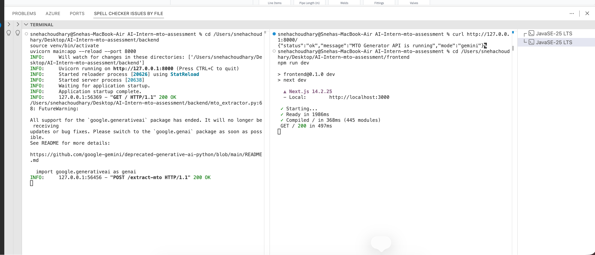
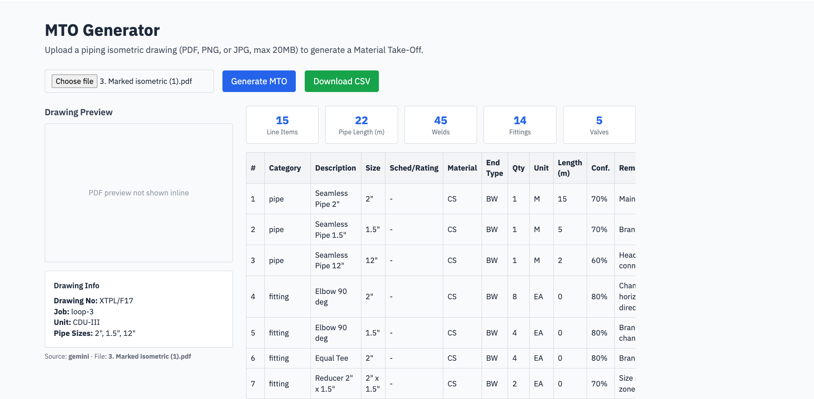
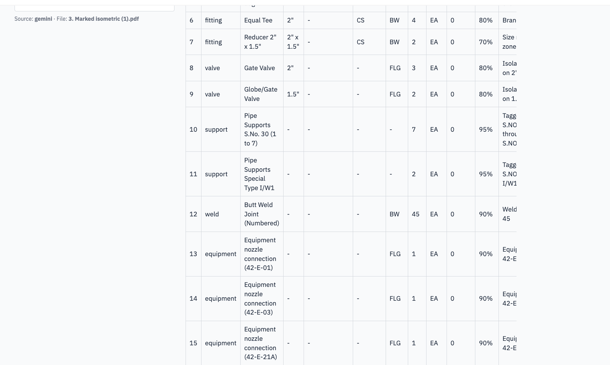

<p align="center">
  
</p>

<p align="center">
  
  
  
  
</p>

<h3 align="center">
  🧾 Submitted for the <b>Full-Stack AI Engineer Intern Assessment</b> — <a href="https://assessmentpathnovo.vercel.app/" target="_blank">Pathnovo</a>
</h3>


---

## 🎯 What is MTO Generator?

> **MTO Generator** takes a piping isometric drawing — PDF, PNG, or JPG — and turns it into a structured **Material Take-Off (MTO)**: pipe runs, fittings, valves, welds, supports, and equipment, each with size, spec, quantity, and confidence score, ready to export as CSV.

Built and tested against the actual assessor-provided sample drawing ("3. Marked isometric (1).pdf" — Loop-3, hand-marked isometric on grid paper).

---

## 🎬 Demo

**Upload screen** — selecting the sample isometric drawing:



**Results — summary dashboard + drawing preview:**



**Results — full MTO table with real Gemini-extracted data:**



---

## ✨ Features

| Feature | Description |
|---------|-------------|
| 📤 **Drawing Upload** | PDF / PNG / JPG, up to 20MB, validated client + server side |
| 🤖 **AI Extraction** | Gemini (multimodal) reads the drawing and returns structured MTO data |
| 🧪 **Mock Mode** | Fully functional without any API key — for grading without credentials |
| 📊 **MTO Table** | Item no, category, size, schedule/rating, material, end type, qty, length, confidence, remarks |
| 📈 **Summary Dashboard** | Auto-calculated totals: pipe length, welds, fittings, valves |
| 🖼️ **Drawing Preview** | View the uploaded drawing beside its extracted data |
| 📥 **CSV Export** | One-click download of the full MTO table |

---

## 🛠 Tech Stack

<div align="center">

| Layer | Technology |
|-------|-----------|
| **Frontend** | Next.js 14, TypeScript, Tailwind CSS |
| **Backend** | FastAPI, Python |
| **AI** | Google Gemini (multimodal) via `google-generativeai` |
| **Data Export** | CSV streaming via FastAPI `StreamingResponse` |

</div>

---

## 📁 Project Structure

```
AI-Intern-mto-assessment/
│
├── frontend/                 # Next.js app
│   ├── app/
│   │   ├── page.tsx           # Upload UI + MTO table + summary + CSV export
│   │   ├── layout.tsx         # Root layout
│   │   └── globals.css        # Tailwind + theme tokens
│   ├── package.json
│   ├── tailwind.config.js
│   └── tsconfig.json
│
├── backend/                  # FastAPI server
│   ├── main.py                # API routes: /extract-mto, /extract-mto/csv, /api/health
│   ├── mto_extractor.py       # Gemini call + mock MTO generator + schema
│   ├── test_main.py           # Backend test suite (6 tests)
│   ├── requirements.txt
│   └── .env.example
│
├── samples/                  # Sample isometric drawing used for testing
│   └── 3. Marked isometric (1).pdf
│
├── screenshots/              # Demo screenshots referenced in this README
│
└── README.md
```

---

## 🌐 API Endpoints

| Method | Endpoint | Description |
|--------|----------|-------------|
| GET | `/` | API status + current mode (gemini / mock) |
| GET | `/api/health` | Health check |
| POST | `/extract-mto` | Upload a drawing, get back structured MTO JSON |
| GET | `/extract-mto/csv?filename=...` | Download the last generated MTO as CSV |

---

## 🏗️ How It Works

1. 📤 User uploads a piping isometric drawing on the Next.js frontend.
2. 🔀 The file is sent to FastAPI's `/extract-mto` endpoint.
3. 🔑 **If `GEMINI_API_KEY` is set** → the drawing is sent directly to Gemini with a structured prompt requesting a specific JSON schema (pipe runs, fittings, valves, welds, supports, equipment).
4. 🧪 **If no key is set** → a realistic mock MTO (based on the sample Loop-3 drawing) is returned instead, so the whole app is testable with zero credentials.
5. 📊 The frontend renders: a summary dashboard, the full MTO table, a drawing preview, and a CSV export button.

---

## 🚀 Setup Guide (exact steps to run locally)

### Prerequisites
- Node.js 18+
- Python 3.10+
- (Optional) A free [Google AI Studio](https://aistudio.google.com/apikey) API key — the app runs fully without one, in mock mode

### 1. Unzip / clone the project

```bash
cd AI-Intern-mto-assessment
```

### 2. Backend setup

```bash
cd backend
python3 -m venv venv
source venv/bin/activate      # Windows: venv\Scripts\activate
pip install -r requirements.txt
cp .env.example .env          # optionally add your GEMINI_API_KEY inside .env
uvicorn main:app --reload --port 8000
```

Leave this running. Backend will be live at **http://127.0.0.1:8000**

### 3. Frontend setup (in a new terminal tab)

```bash
cd frontend
npm install
npm run dev
```

### 4. Open the app

Visit **http://localhost:3000** in your browser, upload a piping isometric drawing (a sample is provided in `/samples`), and click **Generate MTO**.

### 5. (Optional) Run backend tests

```bash
cd backend
pytest test_main.py -v
```

---

## 🔑 Environment Variables

| Variable | Required? | Description |
|----------|-----------|-------------|
| `GEMINI_API_KEY` | No | If unset, the app runs fully in **mock mode**. Get a free key at [aistudio.google.com](https://aistudio.google.com/apikey). |

---

## 🧪 Assumptions & Limitations

- Gemini's extraction accuracy depends on drawing clarity; hand-marked/scanned drawings (like the provided Loop-3 sample) may need manual review of low-confidence rows — this is why each line item includes a `confidence` score.
- `length_m` values are visual estimates, not measured — flagged via the `confidence` field on each item, not treated as exact.
- Single-drawing uploads only (no batch processing yet) — kept the scope focused given the assessment timeline.
- PDF preview in the browser is currently a placeholder message rather than an inline render; only image files (PNG/JPG) show an inline preview. This was a deliberate scope trade-off to prioritize a working extraction pipeline over a PDF.js integration.
- Results are stored in-memory on the backend (not persisted to a database), so CSV export only works for the most recently processed file per session.
- The `google-generativeai` Python package used here is in its sunset period per Google's own deprecation notice; a future iteration would migrate to the newer `google-genai` package.

---

## 🚀 Future Improvements

- Batch upload + multi-drawing MTO aggregation
- Persistent storage (database instead of in-memory)
- OCR pre-pass to improve accuracy on hand-annotated drawings
- Editable table for manual correction before export
- PDF.js-based inline PDF preview
- Migrate to the `google-genai` SDK

---

## 👩‍💻 Developer

<div align="center">

**Built by Sneha Choudhary** for the Full-Stack AI Engineer Intern Assessment — Pathnovo

<p align="center">
  
</p>

</div>
